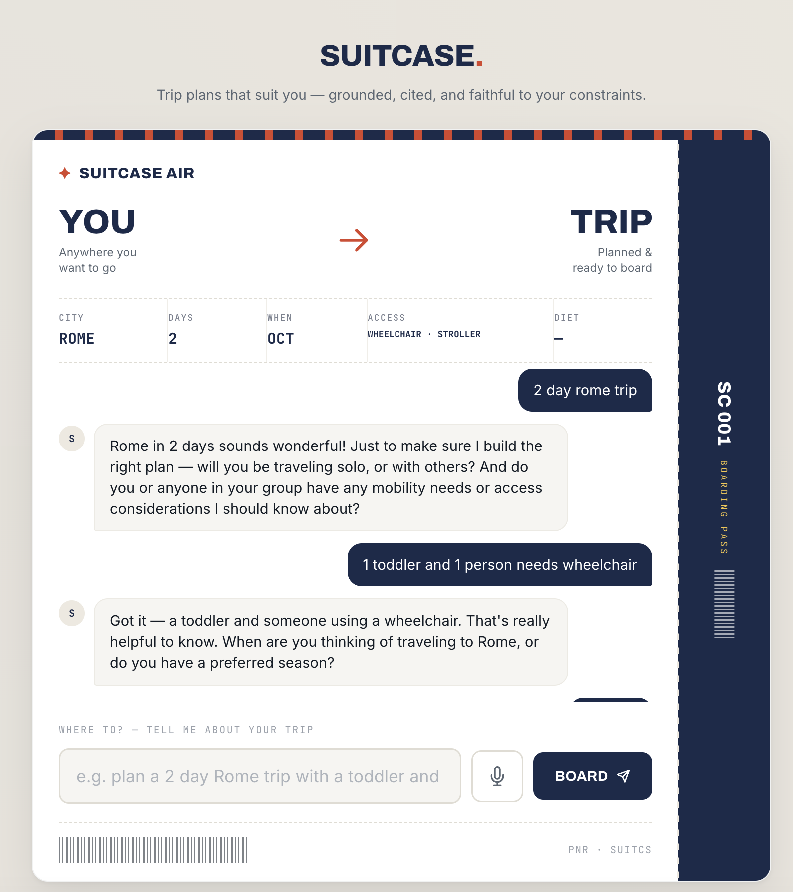
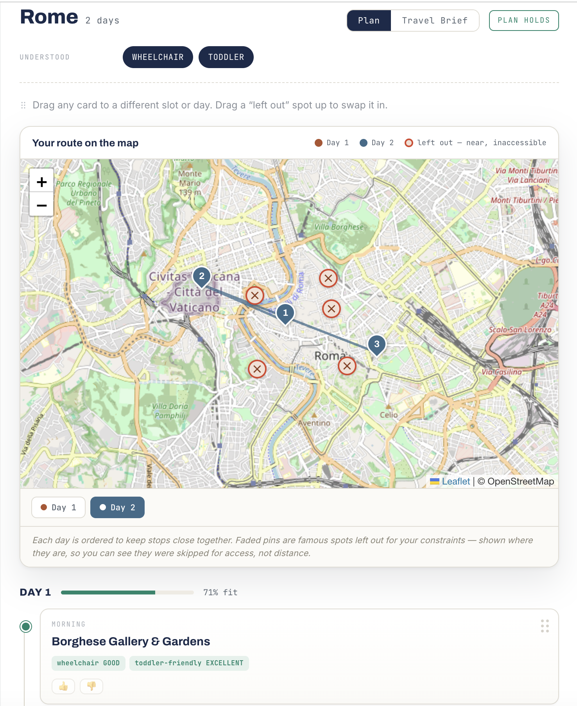
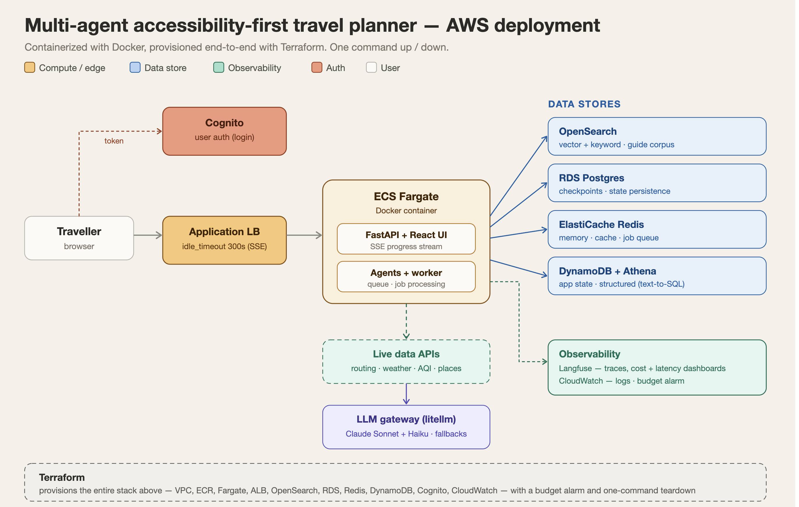
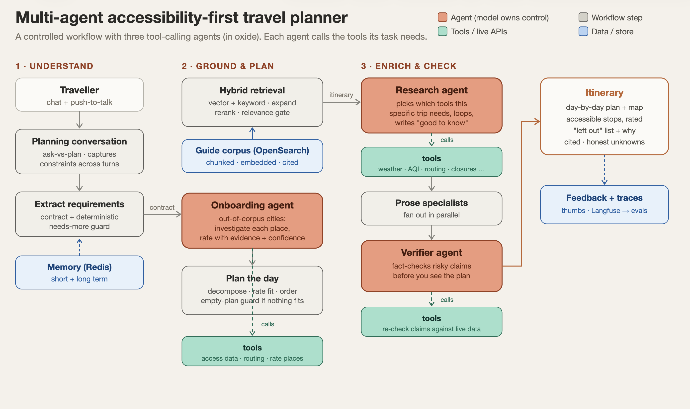
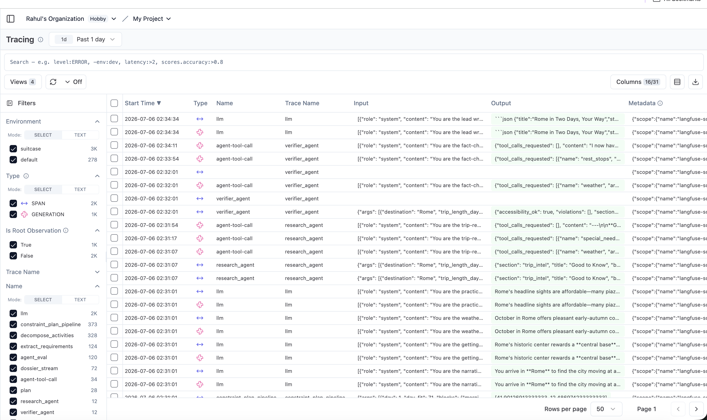

<!--
  © 2026 Rahul Bansal. All rights reserved.
  This repository is published as a portfolio piece for viewing only.
  No permission is granted to copy, modify, redistribute, or use this code
  or its contents, in whole or in part, for any purpose. See "Copyright" below.
-->

# Suitcase — a multi-agent, accessibility-first AI travel planner

> **© 2026 Rahul Bansal · All rights reserved** — portfolio / viewing only. Not licensed for reuse. [See notice ↓](#-copyright)

An AI travel planner that explores what trip planning looks like when **accessibility is the starting point, not an afterthought**. You chat with it in plain language, and it builds a day-by-day itinerary around places that genuinely fit a traveller's constraints — mobility, dietary, medical, sensory — and is honest about what it can't verify.

It is **advisory, not a booking tool**, and focuses on **activities and places**, grounded in a curated travel-guide corpus and live map/data APIs.

---

## Table of contents

- [What it is](#what-it-is)
- [Demo](#-demo)
- [Screenshots](#-screenshots)
- [Features](#-features)
- [Architecture](#-architecture)
- [The agentic core](#-the-agentic-core)
- [Under the hood](#-under-the-hood)
- [Retrieval & the accessibility banks](#-retrieval--the-accessibility-banks)
- [Production engineering](#️-production-engineering)
- [Tech stack](#-tech-stack)
- [Deployment](#-deployment)
- [Running locally](#-running-locally)
- [What I took away](#-what-i-took-away)
- [Copyright](#-copyright)

---

## What it is

Most trip planners treat accessibility as a filter bolted on at the end, if at all. The idea here was to make it the **core constraint**: a planner that reasons about a traveller's needs and can actually back up its choices with evidence.

You tell it what you need:

> *"A 3-day Rome trip for a wheelchair user"*
> *"A 2-day Venice trip with a toddler, vegetarian"*
> *"Barcelona, I need calm, quiet spaces and a pharmacy nearby"*

…and it reads those needs from the conversation, plans a day around places that fit, **flags the well-known spots that don't (and why)**, and says *"I couldn't verify this"* instead of guessing when the data is thin.

---

## 🎥 Demo

<!--
  DEMO VIDEO — GitHub markdown can't embed a local .mp4 with  syntax.
  To make it play inline: edit this README on github.com, delete this line and the
  placeholder below, then DRAG docs/images/demo.mp4 into the editor here. GitHub
  uploads it and inserts a playable video link automatically.
-->


https://github.com/user-attachments/assets/972e42f5-554e-4d5f-b413-1de4c91f5873


> A full wheelchair-trip build, end to end: chat → live progress → finished itinerary with accessible stops, the "left out" list, and the day-by-day plan on a map.

---

## 📸 Screenshots

**Chatting your way to a plan** — you describe the trip in plain language and the agent asks only what it needs.



**The finished plan** — a day-by-day itinerary with accessible stops rated on evidence, an interactive map, and the popular spots left out with the reason for each.



---

## ✨ Features

- **Chat your way to a plan** — a conversational agent that picks up your accessibility needs from the conversation, no forms or filter menus.
- **Day-by-day itinerary** built around places that fit your constraints, ordered so the day flows.
- **Honest flagging** — it tells you which well-known spots don't fit, and why, when the data supports it. Nothing well-known is silently dropped.
- **Nearby restaurant suggestions** around your stops.
- **Push-to-talk voice input**, if you'd rather talk than type.
- **Interactive map** of the whole plan.
- **Practical guidance** per trip — accessibility notes, weather, current air-quality (AQI), local emergency numbers, and getting-around info.
- **Thumbs up / down** on any part of the plan — feedback that shapes how places get rated over time.
- **Share as a PDF by email** — send any finished itinerary and Travel Brief to a single recipient as a branded PDF (with per-place photos), behind a confirmation step.

---

## 🏗 Architecture

The system is a **controlled workflow with three tool-calling agents** dropped in exactly where a decision can't be pre-scripted, running inside a containerized service on AWS.



*The three-agent planning pipeline runs inside ECS Fargate, alongside the API and worker. Grounding data, memory, and structured stores sit behind it; everything is provisioned with Terraform.*

---

## 🤖 The agentic core

It's a multi-agent system — **mostly a deterministic workflow, with real agents where the decision genuinely can't be scripted.** Three of them:

**Research agent** — looks at the trip and decides which tools matter. A wheelchair trip pulls routing + rest stops; a toddler trip pulls playgrounds + holiday closures; a hot climate pulls weather + air quality. Nobody scripts that choice — it reads the tool descriptions and picks, then loops (reason → call a tool → observe → decide again) until it has what it needs.

**Onboarding agent** — for cities outside the vetted corpus, it investigates each place with real map data **before** rating it, instead of letting the model guess accessibility from memory (which produces confident, wrong answers). That work is cached, so the next request for the same city is fast.

**Verifier agent** — reads the finished plan, decides which risky claims are worth checking, and calls tools to verify them **before you ever see the output**.



---

## 🧩 Under the hood

- **Hybrid retrieval** (vector + keyword) with query expansion, metadata filtering, and cross-encoder **reranking** over the guide corpus — plus a **relevance gate** that refuses to ground on chunks that aren't clearly about the requested city.
- **Grounded generation with citations** — every fact in the plan traces back to a source.
- **Text-to-SQL** for structured data, locked to **safe, read-only queries**: parsed and validated as a single `SELECT`, row-capped, with a self-correction retry when the model's SQL is off.
- **Short- and long-term memory** so it accumulates a traveller's constraints coherently.
- **Semantic caching** — two requests that mean the same thing hit the same cached plan.
- **Lazy per-city loading** — a city outside the corpus is ingested and cached on first request, not pre-built ahead of time.
- **Distributed workers + a job queue**, with progress streamed live to the browser over **SSE**.
- **Checkpointing and state persistence**, so a long build can resume instead of restarting.
- **A unified model gateway** (litellm) with provider fallbacks and retries.
- **A layered eval suite** — faithfulness checks, RAGAS, A/B comparisons against simulated users and traffic, and live-traffic evaluation. The suite fails the build on a regression.
- **Full tracing** through Langfuse — every agent decision, tool call, cost, and latency, with dashboards for cost and latency.

### Guardrails

Much of the reliability came from taking **pipeline-breaking decisions away from the model and handling them in code**:

- an **ask-vs-plan** guard that decides in code whether there's enough to plan on (destination + dates), rather than trusting the model, which tended to flip-flop;
- a matching guard that only marks a request *incomplete* when a required field is genuinely missing;
- an **empty-plan** guard that halts with an honest "I couldn't build this" instead of emitting a day of blank placeholders;
- a **stop-asking** guard so that once a need is captured, it moves on instead of looping the same question;
- the **relevance / grounding gate** described above;
- SQL locked to **validated, read-only** statements.

The pattern: *let the model own the content and the judgment calls, but not the control flow or anything with a blast radius.*

### Security posture

Suitcase started **advisory** — plan trips, don't book, pay, or execute anything — so the original threat model wasn't privileged-action abuse; it was **indirect prompt injection through retrieved content** and unsafe tool calls. Those defenses still hold:

- **Prompt isolation.** Retrieved guide passages are treated strictly as *data to ground on*, never as instructions to follow. Grounding is gated on relevance and the requested city, so an out-of-corpus or off-topic chunk can't quietly steer the plan.
- **Tool-call validation.** The text-to-SQL path is the clearest example: generated SQL is parsed and validated as a **single read-only `SELECT`** (via sqlglot), row-capped, and rejected otherwise, with a self-correcting retry. The model proposes; code decides whether the call is safe to run.
- **Output guardrails.** Every accessibility rating must cite a source sentence; **uncited high ratings are automatically downgraded**, and hard constraints are locked by deterministic code the model can't override. Unverifiable claims are surfaced as *unknown* rather than asserted.

**Then I added exactly one privileged action — emailing a trip as a PDF — on purpose.** An advisory system can't demonstrate action-taking security, because there's no action to secure. Adding a single, narrow send capability made the action-taking controls real rather than hypothetical, and they're scoped tightly to it:

- **Tool validation on the action.** The recipient is validated before anything is built — a single, well-formed address, rejecting multi-recipient lists and header-injection (a `\nBcc:` smuggled into the address). Bad input fails fast, before the expensive dossier/PDF build.
- **Human-in-the-loop.** The send refuses unless an explicit `confirm` is passed; the UI shows a confirmation step. An agent can *propose* a send, but the send can't happen without a human in the loop.
- **Least privilege — no raw body.** The send function takes only structured itinerary inputs (recipient, destination, PDF). There is **no** parameter for arbitrary message text — the body is built in code and HTML-escaped. So even if injected content reached this far, there's no channel through which it could become the outgoing message.
- **Privilege separation.** The send capability lives in the API layer, isolated from the agents that read untrusted web/guide content — an injection in fetched content has no path to trigger a send.

The two suites that prove this — an adversarial **prompt-injection** test and an **email-security** test (recipient validation, the confirm gate, and the no-raw-body check) — run in CI and must stay green.

The design rule is the same one that governs the planner: *let the model own content and judgment, but never the control flow or anything with a blast radius.* Email is the one place Suitcase takes a real action, so it's the one place those controls had to become concrete.

### Stage 2 — the human-in-the-loop gate as a durable workflow

The `confirm` boolean above is the *simplest* version of a human-in-the-loop gate: the client sends `confirm: true` and the send happens synchronously inside that one request. It works, but it isn't durable — the pending send lives inside an open HTTP request, so a crash mid-approval loses it, there's no separate reviewer, and a long human delay ties up the request.

Stage 2 replaces that boolean with a **durable Temporal workflow**, and separates the *request* to send from the *approval* to send:

- **Submit.** Clicking "Share" starts a workflow and returns immediately — no waiting on the build. The workflow runs the PDF build as an activity, then **parks**, awaiting a decision.
- **Park.** The parked wait isn't a polling loop — Temporal suspends the workflow to durable storage. It occupies no compute while waiting and can sit parked for as long as the approval window allows.
- **Approve.** A separate **admin approvals page** lists every parked request. An admin clicks Approve, which delivers a **signal** to the workflow (addressed by its id, routed through the Temporal server). The signal wakes the workflow, which runs the send activity. Reject or a timeout ends it without sending.

The property that makes this worth the machinery: **the parked state lives in the Temporal server, not the worker.** Kill the worker mid-approval and nothing is lost — the pending send survives, PDF already built, and any worker resumes it the moment the approval arrives. The same least-privilege, tool-validation, and privilege-separation controls from the synchronous path still apply — the send activity is the only thing that can send, and only a validated recipient with a human approval gets there.

The one-line version: *the gate went from a boolean in a single request to a durable workflow that survives a crash — I killed the only worker mid-approval and the pending send didn't die, because Temporal holds the state, not the process.*


---

---

---

## 🔎 Retrieval & the accessibility banks

Two subsystems do the grounding: **retrieval** (finding the right guide material) and the **accessibility banks** (turning that material into trustworthy, constraint-aware ratings). They're the core of why the planner can be honest instead of confidently wrong.

### How a guide becomes searchable — ingest & chunking

Each city's guide is a structured markdown document (Overview, Neighborhoods, Getting Around, Things to Do, and so on). Ingest is **section-aware**: the chunker splits on paragraph boundaries and packs paragraphs up to a ~900-character budget, so a chunk is a coherent passage rather than an arbitrary window that severs a sentence mid-thought. Each chunk carries its city/page metadata, embedded with **OpenAI `text-embedding-3-small`** (1536-dimensional) and indexed in **OpenSearch**, which holds both the dense vectors (for kNN) and the raw text (for keyword search) — one store serving both halves of hybrid retrieval.

### The retrieval pipeline — five stages, precision and recall engineered separately

A plan doesn't run a single vector lookup. Retrieval is a five-stage pipeline, each stage doing one job:

1. **Keyword extraction** — an LLM pulls the terms most useful for keyword search out of the natural-language request (with a plain-split fallback if the call fails), so the lexical half of the search has good query terms, not the raw sentence.
2. **Metadata filtering** — a few-shot-prompted step emits a small equality filter (`{"city": "Lisbon"}`, `{"region": "Asia"}`, or `{}`) that maps to OpenSearch term filters. This shrinks the search space to the right city/region *before* scoring — the first line of defense against cross-city bleed.
3. **Query expansion** — a smaller, faster model rewrites the question into a handful of semantically equivalent variants (synonyms, alternate phrasings), always keeping the original and any city names intact. This is a **recall** booster: a traveler's wording shouldn't decide whether a relevant passage is found.
4. **Hybrid search** — for each expanded query, run semantic (kNN over the OpenAI vectors) *and* keyword search under the metadata filter, min-max normalize each score set, and blend **0.7 semantic / 0.3 keyword**. Scores are aggregated across all expansions keeping each chunk's best, yielding ~20 candidates. Semantic finds meaning; keyword anchors on exact terms (place names, specific words) that embeddings can smear — the blend gets both.
5. **Cross-encoder rerank** — the ~20 candidates are re-scored by a **BAAI/bge-reranker-large** cross-encoder that reads each (query, chunk) pair jointly (unlike the bi-encoder embeddings, which encode query and chunk separately), and the **top 7** survive. Hybrid search is fast and approximate for **recall**; the reranker is slow and accurate for **precision** — so they're deliberately separate stages, cheap-and-wide then expensive-and-narrow.

### The city-match gate — retrieval's most important guardrail

The subtle, dangerous bug this design exists to prevent: **vector search returns nearest-neighbour chunks regardless of city.** Ask for an obscure or misspelled destination and the index will happily hand back the *semantically closest* chunks from entirely different cities — an early build jammed St. Stephen's Cathedral (Vienna), the Anne Frank House (Amsterdam), and a mountain from Cape Town into a single itinerary, each presented as if it belonged. Confidently wrong is the worst failure a planner can have.

The fix is a **city-match / relevance gate**: retrieved chunks are filtered to those actually tagged with the requested city, and **if none match, the system refuses to ground on them** rather than relabelling a Vienna chunk with the requested city's name. That refusal is what routes an out-of-corpus city to the onboarding agent instead of hallucinating a plan. Grounding, here, means *"only trust a chunk if it's genuinely about this place"* — not just *"it's nearby in vector space."*

### Decompose — from section prose to rateable places

Retrieval returns **section-sized** chunks ("Getting Around: Prague has an excellent transit network…"), but the rater needs **individual places** ("Letná Park — flat, paved, step-free"). Rating a whole section against a wheelchair need is meaningless — an early build scored entire sections `TOUGH` and placed nothing. So a decompose step unpacks each chunk into candidate activities: named places, each carried with the **specific sentence(s) that describe it**, so the rater still has real, citable text to lock hard facts against. The prompt is told to return **nothing** for sections that hold no rateable places (Overview, Best Time to Visit) rather than inventing activities — and a deterministic **byte-identical-note backstop** drops any "place" whose description merely echoes a real place's text, so an *action* ("Coin Throwing") can't slip through carrying a real landmark's note. Each candidate is flagged `is_famous`, which is what lets the assembler build the "left out, and why" list of famous-but-inaccessible spots.

### The accessibility banks — precomputed, confidence-scored ratings

A guide tells you a place *exists*; it doesn't reliably tell you whether a wheelchair user can get in. That's what the **banks** are for: a per-place accessibility dataset (a per-city CSV of ratings with **EXCELLENT / GOOD / TOUGH / FAIL** labels and **HIGH / MEDIUM / LOW** confidence, plus a sourced note and coordinates). A place the planner considers is rated against the bank first.

Crucially, banks are **read-through and lazy-filled**. When a city has no bank yet, one is **built and cached on first request** — corpus cities ship curated, anything new *self-warms on first ask*. Ask for the same city again and it's served from cache instead of rebuilt. The main planning pass reads from the bank, then *supplements* with any retrieved places not yet in it — so the expensive rating work happens once per place, not once per request. The reason facts live in a lockable table rather than being re-derived by retrieval each time: **a table row can be locked, a fuzzy re-derivation can't.** If the bank says the Spanish Steps are a HIGH-confidence `FAIL`, no amount of fluent LLM prose can put them back on the plan.

### How a place gets rated — two layers, code has the final say

The rating logic is deliberately split so the model never gets to be confidently wrong about something checkable:

- **Layer 1 — code locks the hard facts.** Hard constraints (wheelchair, budget) are decided by deterministic code against the bank. A code-decided `FAIL`/`TOUGH` carries `basis: data` and the model **cannot lift it**. Confidence controls how hard the lock is: a HIGH-confidence FAIL is a wall; a LOW-confidence one softens to "tough — verify" rather than blocking on thin evidence.
- **Layer 2 — the model refines the soft judgment, within the lines code already drew.** Soft, subjective aspects (pace, toddler-friendliness as a preference) are the model's to weigh — but every soft rating must **cite a source sentence**, and an uncited high rating is automatically **downgraded**. Unverifiable claims surface as `UNKNOWN`, never guessed.

The governing rule, the same one that runs through the whole system: *RAG describes; code decides.* Retrieval and the model own **content and judgment**; code owns anything **checkable or with a blast radius**.

## ⚙️ Production engineering

The parts of this that took the most thought weren't the prompts — they were the pieces that make an agentic system reliable, observable, and affordable in production.

### Evaluation — two modes

Travel plans rarely have a single "right" answer, so the eval strategy leans on **reference-free** scoring (no golden dataset required) and runs in two complementary modes:

- **Dataset eval — runs on significant change.** When the workflow, prompts, or models change, a labelled set of constraint-faithfulness scenarios runs and **fails the build on a regression**. The scenarios deliberately span the failure classes that matter: *positive* cases (a constraint trip that should build), *refusals* (a made-up city the system must not hallucinate), and *incomplete input* (a missing city or dates it should ask about rather than guess). This is the gate that caught a prompt tweak which quietly made the planner over-ask on basic requests — before any demo would have.
- **Live-traffic eval — reference-free, on sampled real runs.** Sampled production interactions are scored for **faithfulness** (is the answer grounded in the retrieved sources?) and **answer relevancy**, with no ground truth needed. Scores can be pushed to Langfuse so quality is tracked over time, not just at release.

### LLM-as-judge, and calibrating the judge

Grounding is audited by an **LLM-as-judge** that checks claims against the tool results and retrieved context. The interesting problem is that *the judge itself needs evaluating* — a naïvely "strict auditor" persona over-flags, marking correct-but-terse answers as unfaithful. Getting a trustworthy signal meant calibrating the judge's persona and threshold so its flags track real problems rather than stylistic nitpicks. A judge you haven't calibrated is just another unmeasured model in the loop.

### The feedback flywheel (online → offline)

Every interaction is logged (`log_interaction`) with its request, retrieved context, and output. Two things happen with that stream:

1. **Corrections compound into data.** Accessibility ratings the system is unsure about are surfaced with LOW confidence rather than hidden. When a traveller corrects one, that correction is captured — and over time those corrections compound into higher-confidence, more trustworthy data. That flywheel, not the model, is where the real product value accrues.
2. **Bad runs become tomorrow's test cases.** A production trace that went wrong is exactly the case the offline suite was missing, so it gets folded back in. Offline and online evaluation stop being two separate activities and become one loop.

### A/B and load testing with simulators

Because iterating against real users is slow and risky, the repo includes simulators to exercise the system without them:

- **Synthetic users** — persona-driven travellers with varied constraints, to probe how the planner behaves across the space of requests rather than the handful a developer would type by hand.
- **Simulated traffic** — driving volume through the queue/worker path to observe behaviour under load, not just single-request happy paths.
- **A/B experiments** — a real harness (`simulate_ab`) that assigns users to variants via Redis and compares two configurations on the same population. Two built-in scenarios: a **model experiment** (strong vs fast/cheap model on the write step — the cost question) and a **prompt experiment** (default vs concise prompt — the style question). It runs in **dry-run mode** (free — sets the experiment, assigns the split, verifies the plumbing without firing any LLM calls) or **real mode** (fires traffic through the live endpoint). Real runs are tagged `variant:A` / `variant:B` in Langfuse, so the two arms are compared on the same traces and metrics rather than on vibes.

### Distributed, async execution

A full plan build is long-running (retrieval, multiple agents, several tool calls), so it doesn't block a request thread:

- **Worker + job queue.** The API accepts a plan request, enqueues it, and returns immediately; a separate **worker** process picks it up and does the heavy work. This is what keeps the API responsive and lets builds scale horizontally.
- **Live progress over SSE.** As the worker moves through phases, progress is streamed back to the browser over **Server-Sent Events**, so the user watches the plan take shape instead of staring at a spinner. (This is also what forced the load-balancer idle-timeout tuning — a naïve default silently cut the stream mid-build.)
- **Checkpointing + resume.** Build state is persisted, so a long run can resume from where it was rather than restarting from scratch if a worker restarts.
- **Parallel fan-out.** Where steps are independent (the prose specialists), they run in parallel rather than in sequence.

### Reliability & cost as first-class concerns

- **Model gateway with fallbacks.** All model calls go through a single gateway (litellm) with a provider fallback chain and retries, so a transient provider error degrades gracefully instead of failing the build.
- **Model routing for cost.** High-volume agent loops run on a smaller, faster model (Haiku), with the stronger model (Sonnet) reserved for calls that genuinely reason — roughly a **10x** cost reduction with little quality loss.
- **Caching at two levels.** *Semantic caching* means two requests that mean the same thing hit the same cached plan; *lazy per-city loading* means a new city is ingested and cached on first request rather than pre-built.
- **Cost-aware deploy.** The cloud image runs a lean retrieval config (the heavy cross-encoder reranker runs locally) to keep the container small and cheap, with a monthly budget alarm on the infrastructure.

### Observability that closes the loop

Every agent decision, tool call, cost, and latency is traced through **Langfuse**, with dashboards for cost and latency. This is what turns "it just hangs" into "I can see which call stalled" — and, because the same traces feed the live-traffic eval, observability and evaluation are wired into a single feedback loop rather than living in separate tools.



*A trace in Langfuse — each agent decision and tool call is a span, with cost and latency attached, so a stalled or misbehaving run is debuggable at a glance.*

## 🛠 Tech stack

**Models**
Claude (Sonnet + Haiku) · GPT-4o · text-embedding-3-small

**Agents & orchestration**
LangGraph · litellm (model gateway) · custom tool-calling agents

**Retrieval & data**
OpenSearch (vector + keyword) · sentence-transformers (cross-encoder reranker) · Athena · Postgres · DynamoDB · Redis

**API & UI**
FastAPI · React · SSE streaming · Whisper (speech-to-text) + OpenAI TTS (voice output)

**Evaluation & observability**
RAGAS · a layered custom eval suite · Langfuse (tracing + dashboards)

**Infrastructure**
AWS — Fargate + ALB, OpenSearch, RDS, ElastiCache Redis, Cognito, CloudWatch · Docker · Terraform (one-command deploy and teardown)

---

## 🚀 Deployment

The entire stack is **infrastructure-as-code**. Terraform provisions everything — VPC, ECR, ECS Fargate, ALB, OpenSearch, RDS, ElastiCache Redis, DynamoDB, Cognito, CloudWatch — with a monthly budget alarm.

```bash
./deploy.sh up       # provision + build + push + load data + go live
./deploy.sh verify   # confirm what's running / that teardown is clean
./deploy.sh down     # tear the whole stack down
```

The load balancer is tuned for the long-running, streamed plan builds (extended idle timeout for SSE), and the container runs a lean retrieval config to keep costs down in the cloud while the full reranking stack runs locally.

---

## 💻 Running locally

> This repo is published as a **portfolio showcase**, not a turnkey install — a few pieces (the guide corpus, API keys, and cloud stores) aren't included. The notes below are for orientation.

At a high level:

```bash
# Python 3.12, using uv
uv venv && source .venv/bin/activate
uv pip install -r requirements.txt

# configure environment (models, keys, store endpoints) in a .env file

# run the API + worker
uvicorn app.api.main:app --reload
```

The frontend is a React app served alongside the API. Retrieval, evals, and ingestion each have their own entry points under `app/` and `eval/`.

---

## 💡 What I took away

- **Cost is a design constraint.** Routing high-volume agent loops from the strong model to a smaller, faster one cut spend ~10x with barely any quality loss. Match the model to the job, not the whole system to your best model.
- **Guardrails did a lot of the reliability work.** The biggest wins came from taking pipeline-breaking decisions out of the model and into deterministic code. Let the model own the content, not the control flow.
- **Evals caught what I couldn't eyeball.** With a dozen moving parts, a fix for one city would quietly break another. The suite — positive cases, refusals, incomplete input — fails the build on a regression, and once caught a prompt tweak that made the planner over-ask before any demo would have.
- **Observability makes agents debuggable — and closes the loop with evals.** Tracing every decision turned "it just hangs" into "I can see which call stalled." Real runs get logged and become the next eval case, so offline and online evaluation end up as one loop.
- **Grounding with a confidence gate beats fluency.** The planner only builds on evidence that clears a relevance bar, marking anything it can't verify as unknown. For an accessibility tool, an unverified "yes, it's accessible" is the wrong answer you least want to ship.

---

## 📄 Copyright

**© 2026 Rahul Bansal. All rights reserved.**

This repository and its contents (code, documents, diagrams, and written material) are made public **for portfolio and evaluation purposes only**. No license is granted. You may **view** the repository, but you may **not** copy, modify, redistribute, publish, or use any part of it — in source or compiled form — for any personal, academic, or commercial purpose without prior written permission from the author.

All third-party libraries, models, and services referenced remain the property of their respective owners and are used under their own licenses.

---

<sub>Built by Rahul Bansal. For questions or to discuss the work, reach out on LinkedIn.</sub>
