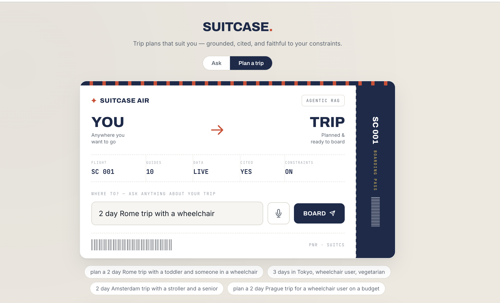
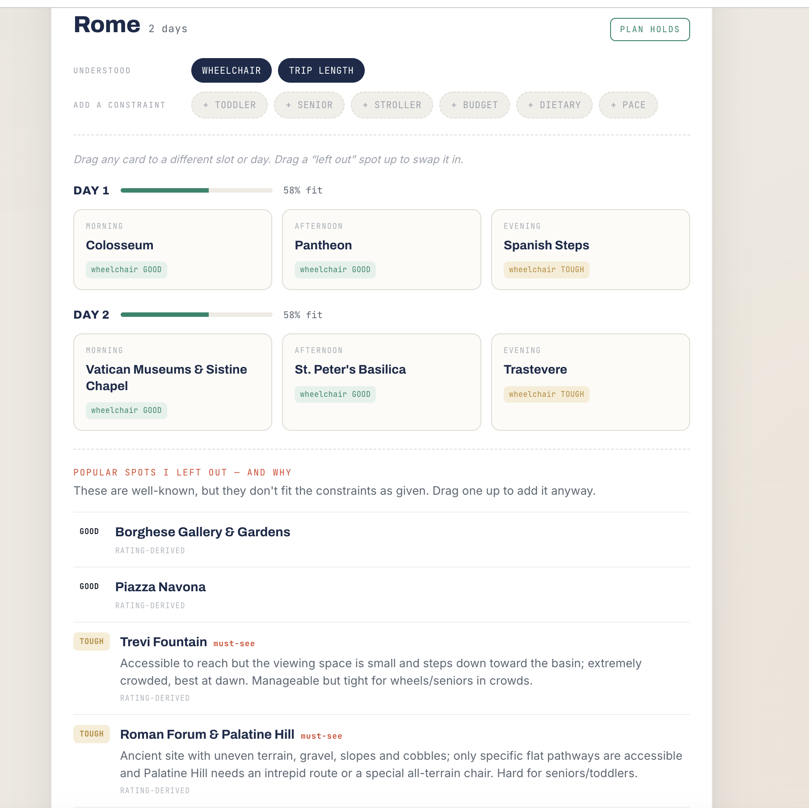
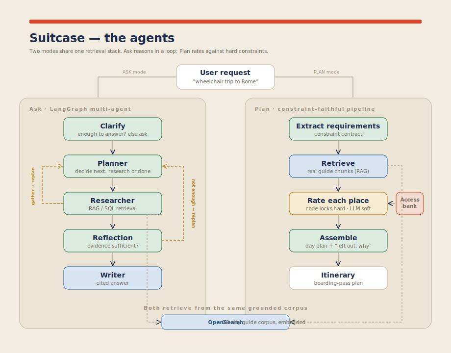
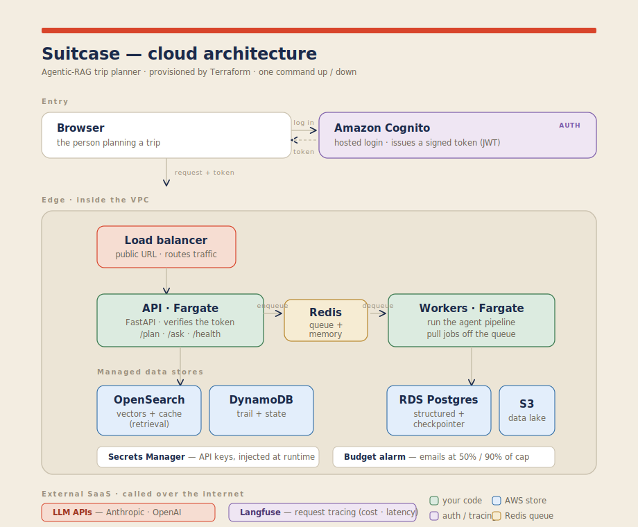

# Suitcase — a constraint-faithful, agentic-RAG trip planner

Suitcase plans trips that **respect hard constraints** — wheelchair access, budget, dietary needs — that mainstream AI trip planners quietly ignore. Ask most tools for a "wheelchair-friendly Rome trip" and they cheerfully include the Spanish Steps (which are, literally, stairs). Suitcase leaves them out — and **tells you why**.

It's an agentic Retrieval-Augmented Generation system with two modes: a **multi-agent reasoning loop** for open questions, and a **constraint-faithful planning pipeline** that rates every candidate place against your hard requirements before it lands on your itinerary. It's grounded in a 26-city guide corpus, cites its sources, and is honest about the edges of what it knows.

Built to demonstrate production-shaped agentic-RAG end to end: a real retrieval pipeline, multi-agent orchestration, evaluation on live traffic, tracing, and a one-command AWS deployment behind authentication.

---

## The demo

**Plan mode** — enter a trip with its constraints. The input is a boarding pass; the output is the itinerary.



**The result** — a wheelchair-friendly, 2-day Rome itinerary. Every placed activity is rated and cited. Below the plan is the section that makes the system trustworthy: **"Popular spots I left out — and why."** Famous, must-see places are *correctly refused* when they don't fit the constraint, each with a sourced reason.



> Full flow — login, planning, and the editable drag-and-drop itinerary — in [`screenshots/demo.mov`](./screenshots/demo.mov).

What the plan does that others don't:
- **Spanish Steps -> TOUGH** — the steps are stairs; enjoy the view from the base instead
- **Trevi Fountain -> TOUGH**, marked *must-see* — small viewing space, steps to the basin
- **Roman Forum -> TOUGH** — uneven gravel and cobbles
- Placed instead: Colosseum, Pantheon, Vatican Museums, St. Peter's — all rated **GOOD** for wheelchair access, with citations

The north star: **respect a hard constraint even when it means dropping a landmark, and be honest about the trade-off.**

---

## How it thinks

Two modes share one grounded retrieval stack.



**Ask mode** — a multi-agent loop on LangGraph, checkpointed in Postgres:
`clarify -> planner -> researcher -> reflection -> writer`.
The planner decides whether more retrieval is needed; **reflection** checks whether the evidence is sufficient and loops back to re-plan if not; the writer only produces a cited answer once the loop is satisfied. Two reflection loops — *process* (right tool/path?) and *data* (enough evidence?) — are what make it agentic rather than a single call.

**Plan mode** — a constraint-faithful pipeline:
`extract requirements -> retrieve -> rate each place -> assemble`.

The heart of it is the **two-layer rater**:
- **Code owns the hard constraints.** Wheelchair access and budget are decided deterministically from a structured *accessibility bank* — a per-city table of sourced ratings (EXCELLENT / GOOD / TOUGH / FAIL / UNKNOWN) with confidence levels. A hard FAIL is a locked wall; no amount of fluent LLM prose puts a stairs-only landmark back on the plan.
- **The LLM refines the soft constraints** (toddler-friendly, pace) *within* the lines code already drew.

Confidence feeds the lock: a HIGH-confidence FAIL is a true wall; a LOW-confidence FAIL softens to "TOUGH — verify," so an unverified guess never slams a door. When a city is genuinely hard for the given constraints, the assembler leaves day-slots **honestly empty** with a note rather than padding the plan.

---

## The retrieval pipeline

Retrieval isn't a single vector lookup — it's a 5-stage pipeline (each stage its own module under `app/retrieval/`):

1. **Keyword extraction** — pull the load-bearing terms from the query.
2. **Metadata filter** — generate a structured filter (city, section) so search is scoped, not global.
3. **Query expansion** — rewrite the question into several semantically-equivalent variants to widen recall.
4. **Hybrid search** — for each variant, run semantic (kNN) **and** keyword search under the filter, min-max normalize each, and blend **0.7 semantic / 0.3 keyword**, then aggregate across variants.
5. **Cross-encoder rerank** — re-score the candidate pool with a cross-encoder and keep the top-K.

The result is a grounded answer with per-chunk citations. In Plan mode, the same ranked chunks feed the per-place rater rather than a single assembled blob — so each candidate place is rated on its own evidence.

---

## How it runs

Deployed to AWS from a single command (`./deploy.sh up` / `down`), fully defined in Terraform.



- **Compute:** the API and a separate worker pool run on **ECS Fargate**, behind an **Application Load Balancer**.
- **Retrieval:** the 26-city corpus is embedded and indexed in **Amazon OpenSearch** (hybrid vector + keyword, plus a semantic cache).
- **State & queue:** **DynamoDB** holds the agent step-trail; **RDS Postgres** is the LangGraph checkpointer; **Redis on ElastiCache** is the job queue (async path) and session memory.
- **Auth:** **Amazon Cognito** issues JWTs; the app verifies them in a FastAPI dependency. Enforced in the cloud, bypassed in local dev.
- **Secrets & cost:** API keys live in **Secrets Manager**, injected at runtime (never baked into the image); a **budget alarm** emails at 50% / 90% of a cap.
- **Tracing:** every request and LLM call is traced to **Langfuse** (cost, latency, the reasoning trail).

The store abstraction is the point: moving from local Docker (OpenSearch, Postgres, Redis) to managed AWS services was a **config change, not a code change** — the app talks to the same interfaces either way.

---

## Evaluation

Most side projects have no evaluation. Suitcase runs two modes:

- **Dataset eval** — runs on significant change (workflow / prompts / models) against a labeled set, with reference answers.
- **Live-traffic eval** — a daily batch that samples real answered requests (logged to DynamoDB with question, answer, and retrieved contexts) and scores them with **reference-free** metrics (faithfulness, answer relevancy) — no ground truth needed. It can push scores to Langfuse / CloudWatch and alert if faithfulness drops.

Traffic can be simulated locally to exercise the whole path without real users.

---

## Engineering decisions worth defending

The choices an interviewer tends to probe, and the honest reasoning behind each.

**RAG describes; a structured bank decides.** Retrieval tells you what a place *is* (narrative). It can't be trusted to decide whether a place *passes a hard rule* — an LLM optimizing for a fluent answer will include the famous landmark. So hard constraints are decided by code against a lockable table, not by the model. This split is the whole reliability story.

**ALB, not API Gateway.** The app is a persistent Fargate container with a Server-Sent-Events streaming endpoint. API Gateway's timeouts and buffering fight SSE, and it'd sit on top of the ALB anyway. ALB fits a long-running container; API Gateway is for Lambda / managed-API features this app doesn't need.

**Redis queue, not SQS.** The queue lives in Redis (ElastiCache) because the same store also does session memory *and* pub/sub for live token streaming — which SQS can't do — and it keeps local/cloud parity. SQS would be the more AWS-native pure-queue choice (DLQs, visibility timeouts); noted as a production upgrade.

**Auth verified in-app, not at the edge.** Cognito issues tokens; the app verifies the JWT signature (JWKS fetch, RS256, issuer/audience/expiry). This keeps SSE streaming intact and needs no HTTPS/cert/domain for the API — and it's the transferable pattern (same verification in any framework).

**Provider-agnostic model layer.** All LLM/embedding calls go through a unified layer (LiteLLM) with a model chain and **provider fallback** — Claude for reasoning, OpenAI for embeddings (Anthropic has no embeddings API), swappable to Bedrock or Ollama by config.

---

## Limitations & what's next

Honest about what this is: a **portfolio-grade prototype**, not a product.

- **The data is the moat, and it's thin.** Accessibility ratings are hand-researched for 26 cities from firsthand wheelchair-traveler accounts and official venue pages. Out-of-corpus cities fall back to guide-derived, then model-knowledge ratings (flagged, LOW confidence). The real next step is a **correction/feedback loop** — users correcting ratings, compounding into trustworthy data. That flywheel is the actual product hypothesis.
- **Auth is tested, not production-hardened.** Login works (Cognito -> token -> verified in-app, confirmed via CLI and an in-app login). The full hosted-UI browser flow over HTTPS (ACM cert + domain) is the next step.
- **Single-tenant.** Serving real users needs data isolation at the store layer (user-partitioned DynamoDB, Postgres row-level security, namespaced cache) — designed, not yet built.
- **Freshness.** Access details change; production would need `last_verified` timestamps and a re-check cadence.

---

## Run it locally

Python 3.11 or 3.12 (the ML stack has no 3.13+ wheels yet).

```
make venv PY=python3.12
source .venv/bin/activate
make install
cp .env.example .env          # defaults wired for local dev; add ANTHROPIC + OPENAI keys
make up                       # opensearch + dynamodb-local + postgres + redis (+ minio)
make index                    # create the OpenSearch index + DynamoDB tables
make ingest                   # extract -> chunk -> embed -> index the 26-city corpus
make health                   # confirm every dependency is reachable
make run                      # http://localhost:8080
```

Every database runs locally and free; only the model calls leave your machine (Anthropic + OpenAI by default, or Bedrock / Ollama by config). Auth is off locally, so no login is needed. See `BUILD_AND_DEPLOY.md` for the full guide and `RUNBOOK.md` for the AWS deploy.

---

## Stack

**Orchestration:** LangGraph · FastAPI · Python
**LLMs:** Anthropic (reasoning) + OpenAI (embeddings) via LiteLLM, with provider fallback
**Retrieval:** OpenSearch (hybrid kNN + keyword, cross-encoder rerank, semantic cache) · 26-city corpus
**State / queue:** DynamoDB · RDS Postgres · Redis
**Infra:** Terraform · ECS Fargate · ALB · Cognito · Secrets Manager · ElastiCache
**Observability & eval:** Langfuse tracing · reference-free live-traffic scoring

---

*Suitcase is an independent portfolio project — advisory, not a booking tool, activities only. Sample corpus and ratings are compiled for the demo.*
